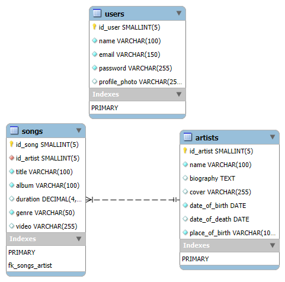

# Base de datos para una pagina de música

## Desarrolladores:

- Nombre: Martín Lorenzi
  - Email: alorenzi@alumnos.exa.unicen.edu.ar

**El objetivo de este proyecto es desarrollar una base de datos para una aplicación de musica.**

#### diagrama de relacion entre tablas:

 
**Por lo tanto para el desarrollo de esta propuesta se considera que:**

**El usuario será capaz de visualizar un conjunto de **canciones** (ítems), cada una perteneciente a un determinado **artista** (categoría).